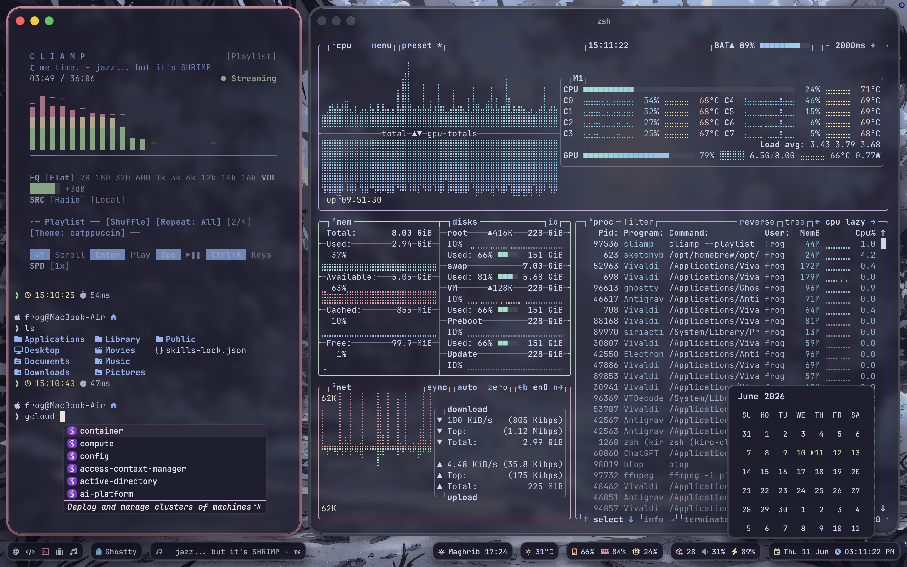

# froggologies/dotfiles

A curated, automated dotfiles setup for macOS focused on a modern, highly customizable desktop experience and an efficient CLI workflow. Built using [chezmoi](https://chezmoi.io/) and Homebrew to effortlessly reproduce the perfect developer environment across machines.

## Highlights

### Desktop Customizations

- **[SketchyBar](https://felixkratz.github.io/SketchyBar/)** - A highly customizable macOS status bar replacement
- **[Borders](https://github.com/FelixKratz/JankyBorders)** - A lightweight window border system for macOS
- **[Raycast](https://www.raycast.com/)** - A blazingly fast, totally extendable launcher
- **[Loop](https://github.com/MrKai77/Loop)** - Window management made elegant
- **[AltTab](https://alt-tab-macos.netlify.app/)** - Windows alt-tab on macOS

### Terminal & Shell

- **[Ghostty](https://ghostty.org/)** - A fast, feature-rich, and cross-platform terminal emulator
- **[Warp](https://www.warp.dev/)** - The terminal for the 21st century
- **[Oh My Posh](https://ohmyposh.dev/)** - A custom prompt engine for any shell
- **[kiro-cli](https://github.com/kiro-cli/kiro)** - Terminal auto suggestion

### CLI Tools

- **[btop](https://github.com/aristocratos/btop)** - Resource monitor that shows usage and stats for processor, memory, disks, network and processes
- **[eza](https://github.com/eza-community/eza)** - A modern replacement for ls
- **[bat](https://github.com/sharkdp/bat)** - A cat clone with syntax highlighting
- **[mise](https://mise.jdx.dev/)** - Dev tools, env vars, task runner
- **[Mole](https://github.com/tw93/Mole)** - Clean, uninstall, analyze, optimize, and monitor your Mac from the terminal.
- **[cliamp](https://github.com/bjarneo/cliamp)** - Terminal music player inspired by winamp

### DevOps Tools

- **[Docker](https://www.docker.com/)** / **[OrbStack](https://orbstack.dev/)** - Containerization platform and fast, light macOS alternative
- **[lazydocker](https://github.com/jesseduffield/lazydocker)** - A simple terminal UI for docker
- **[Colima](https://github.com/abiosoft/colima)** - Container runtimes on macOS (and Linux) with minimal setup
- **[helm](https://helm.sh/)** - The Kubernetes Package Manager

## Automated Setup

During `chezmoi apply`, file hashes are tracked to trigger automated installations and configurations:

- **`run_onchange_before_1_trust_homebrew_taps.sh.tmpl`**: Parses `src/Brewfile` to automatically `brew trust` third-party taps.
- **`run_onchange_after_1_homebrew.sh.tmpl`**: Runs `brew bundle` against `src/Brewfile` and automatically restarts services like `sketchybar` and `borders`.
- **`run_onchange_after_2_mise.sh.tmpl`**: Runs `mise install` using `dot_config/mise/config.toml` to provision runtimes (Node, Python) and global npm packages.
- **`run_onchange_after_3_aicommits.sh.tmpl`**: Configures the `aicommits` tool.

## Setup

1. Install homebrew: [brew.sh](https://brew.sh)
2. Install chezmoi: `brew install chezmoi`
3. Initialize chezmoi: `chezmoi init https://github.com/froggologies/dotfiles.git`
